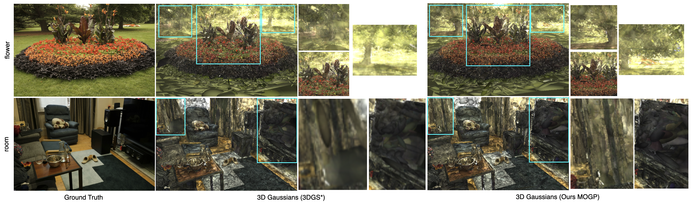
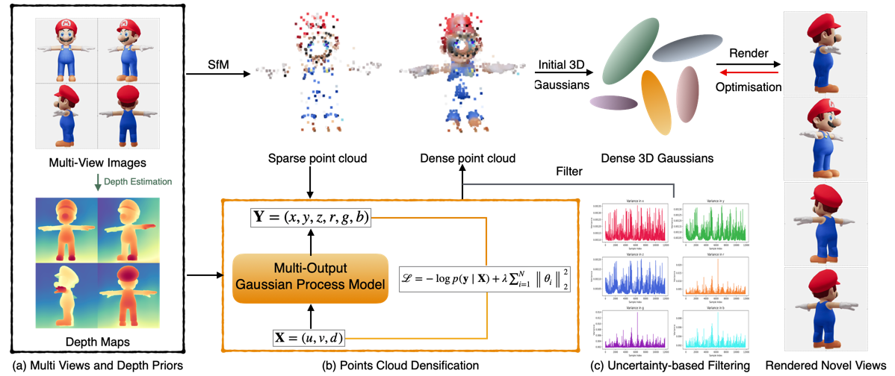

# GP-GS: Gaussian Processes for Enhanced 3D Gaussian Splatting
**This is the anonymous code repository for ICML2025 submission paper: GP-GS: Gaussian Processes for Enhanced 3D Gaussian Splatting **
## Additional Quantitative and Qualitative Results on NVS
### Table 1: More Quantitative Comparison of Scaffold-GS and Ours on Mip-NeRF 360, NeRF Synthetic, HDR-GS - flowers and Tanks & Temples
| Dataset                    | Scaffold-GS             |        |        |        | Ours (Scaffold-GS + MOGP) |        |        |        |
|----------------------------|--------------------------|--------|--------|--------|----------------------------|--------|--------|--------|
|                            | Init Points              | PSNR ↑ | SSIM ↑ | LPIPS ↓ | Init Points                | PSNR ↑ | SSIM ↑ | LPIPS ↓ |
| Mip-NeRF 360 - flowers     | 17768                    | 23.08  | 0.707  | 0.237   | 18222                     | **23.15** | **0.709** | **0.236** |
| Mip-NeRF 360 - garden      | 43408                    | **29.56** | 0.919  | 0.064   | 53688                     | 29.53   | 0.919   | 0.064   |
| Mip-NeRF 360 - room        | 39710                    | 32.22  | 0.939  | **0.118** | 50490                   | **32.30** | 0.939   | 0.120   |
| Mip-NeRF 360 - counter     | 60108                    | 29.73  | 0.917  | 0.121   | 74538                     | **29.83** | **0.918** | **0.119** |
| Mip-NeRF 360 - kitchen     | 112765                   | 31.86  | 0.943  | 0.073   | 120405                    | **31.87** | **0.944** | **0.073** |
| Tanks & Temples - truck    | 65194                    | 25.45  | 0.879  | 0.150   | 72254                     | **25.57** | **0.880** | 0.150   |
| Tanks & Temples - train    | 104578                   | 22.50  | 0.828  | 0.198   | 124109                    | **22.53** | **0.830** | **0.196** |
| NeRF Synthetic - lego      | 13078                    | 28.62  | 0.926  | 0.075   | 21731                     | **28.90** | **0.929** | **0.074** |
| NeRF Synthetic - drums     | 5086                     | 25.51  | 0.936  | 0.068   | 6387                      | **25.53** | **0.937** | 0.068   |
| NeRF Synthetic - ficus     | 467                      | 25.98  | 0.925  | 0.061   | 1141                      | **25.99** | **0.927** | **0.060** |
| NeRF Synthetic - mic       | 7064                     | 27.67  | 0.852  | 0.153   | 10487                     | **27.71** | **0.853** | **0.152** |
| NeRF Synthetic - material  | 2273                     | 17.88  | 0.749  | 0.221   | 3749                      | **18.11** | **0.755** | **0.219** |
| HDR-GS - flowers           | 19593                    | 17.54  | 0.816  | 0.198   | 31193                     | **17.56** | 0.816   | **0.197** |
### Table 2: Comparison of InstantSplat and Ours on Mip-NeRF 360- flowers
| Dataset                |  InstantSplat |            |        |        |         Ours (InstantSplat + MOGP) |     |        |        |        
|------------------------|----------------|--------|--------|--------|------------------------|--------|--------|--------|
|                        | Init Points    | PSNR ↑ | SSIM ↑ | LPIPS ↓ | Init Points            | PSNR ↑ | SSIM ↑ | LPIPS ↓ |
| Mip-NeRF 360 - flowers | 2979           | 11.46  | 0.242  | 0.763   | 18222                 | **11.58** | 0.242   | **0.751** |
### Figure 2: More Qualitative Comparison Results on NVS

### Figure 3: Qualitative comparison of 3D Gaussians during 3DGS training process. The left column shows the ground truth images. The middle column presents 3D Gaussians from 3DGS*, while the right column shows 3D Gaussians generated using our MOGP.


## 😊️ Pipeline



# GP-GS: Gaussian Processes for Enhanced Gaussian Splatting

## Overview
GP-GS is a novel framework that enhances the initialization of 3D Gaussian Splatting (3DGS) by leveraging Multi-Output Gaussian Processes (MOGP). It improves the rendering quality of novel view synthesis by densifying sparse point clouds reconstructed via Structure-from-Motion (SfM). The method is particularly effective in complex regions with densely packed objects and challenging lighting conditions.

## Pipeline
Our pipeline consists of the following steps:

1. **Multi-View Image Input**: We start with multi-view images and extract per-view depth maps using depth estimation models (e.g., Depth Anything).
2. **SfM Reconstruction**: Sparse point clouds are generated from the input images using Structure-from-Motion (SfM).
3. **Point Cloud Densification**: 
   - MOGP is trained to take pixel coordinates and depth values as input and predict dense 3D points with position and color information.
   - A Matérn kernel is used to model smooth spatial variations, and the parameters are optimized via gradient updates.
4. **Uncertainty-Based Filtering**:
   - High-variance noisy points are filtered out based on a variance-based thresholding strategy to ensure structured densification.
5. **Gaussian Initialization and Optimization**:
   - The densified points are used to initialize 3D Gaussians, which undergo further optimization to improve geometric accuracy.
6. **Novel View Rendering**:
   - The optimized 3D Gaussians are used for efficient rasterization-based rendering to synthesize high-quality novel views.
## Local setup
conda env create --file environment.yml
conda activate GP-GS
### Running
**MOGP**:
```shell
python MOGP/mogp_train.py
python MOGP/predict.py
```
**MOGP for 3D gaussians Initialization**:
```shell
python MOGP/rewrite_images_sfm.py
python MOGP/write_points3d.py
```
**3DGS***:
```shell
python train.py -s <scene path>
```
**Render and Evaluation**:
```shell
python render.py -m <model path>
python metrics.py -m <model path>
```


```
